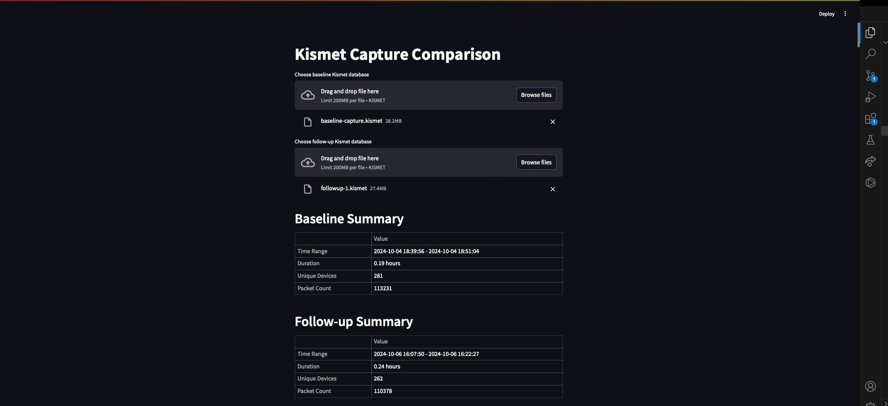
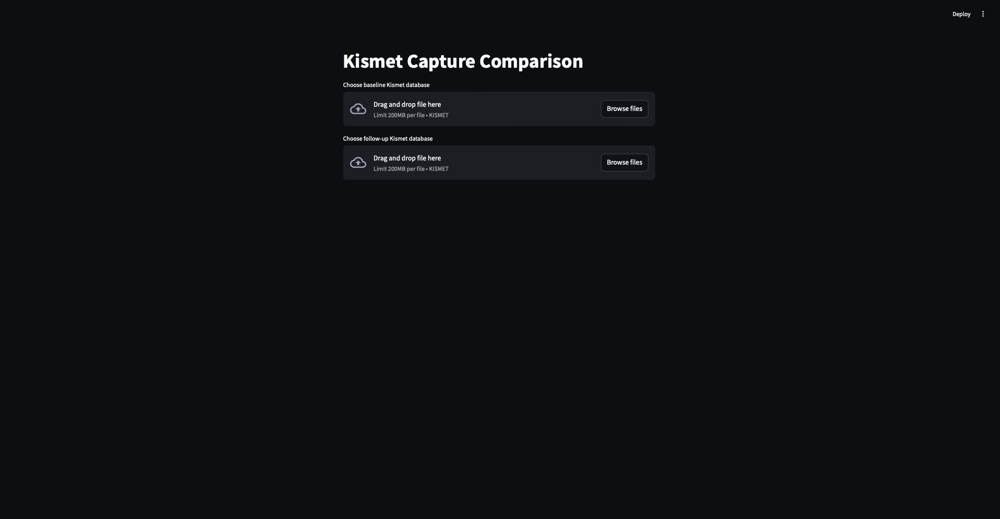
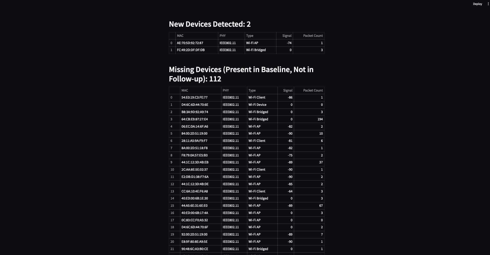

# SignalSift

SignalSift is an application designed for autonomous analysis and comparison of Kismet wireless captures.



## Description

SignalSift is a powerful Streamlit-based tool that automates the analysis and comparison of Kismet wireless capture databases. It's designed for network administrators, security professionals, and technical surveillance countermeasures (TSCM) specialists who need to efficiently analyze changes in wireless environments.

## Features

- Upload and compare baseline and follow-up Kismet captures
- Generate comprehensive summaries of wireless activity
- Identify top active devices in each capture
- Detect new and missing devices between captures
- Analyze device types, signal strengths, and packet counts
- Intuitive web interface for easy visualization of results

## Installation

1. Clone the repository:
   ```
   git clone https://github.com/Halcy0nic/SignalSift.git
   ```

2. Navigate to the project directory:
   ```
   cd signalsift
   ```

3. Install the required dependencies:
   ```
   pip install -r requirements.txt
   ```

## Usage

1. Run the Streamlit app:
   ```
   streamlit run signalsift.py
   ```

2. Open your web browser and go to the URL provided by Streamlit (usually http://localhost:8501)



3. Use the file upload buttons to select your baseline and follow-up Kismet database files

4. The application will automatically analyze and compare the captures, presenting the results in an easy-to-read format




## Requirements

- Python 3.7+
- Streamlit
- SQLite3
- Pandas

See `requirements.txt` for a full list of dependencies.

## Contributing

Contributions to SignalSift are welcome! Please feel free to submit a Pull Request.

## License

This project is licensed under the MIT License - see the LICENSE file for details.

## Acknowledgments

Kismet Wireless for their excellent wireless network detector and sniffer